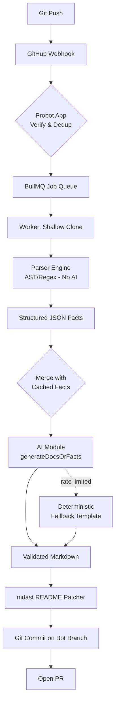

# DocFlow AI

> **Automated Repository Documentation & Intelligence Platform** — the "Vercel for Documentation" that keeps your READMEs and technical docs automatically up to date whenever you push code.

[](https://github.com/your-org/docflow-ai/actions/workflows/ci.yml)
[](LICENSE)
[](https://pnpm.io/)

---

## How It Works

```
Git Push → GitHub Webhook → Queue → Parser (AST/regex, zero AI)
    → Structured JSON Facts → AI (only sees facts, never raw code)
    → Validated Markdown → Surgical README Patch → PR
```

**Parser-First Architecture** — raw source code **never** enters the LLM context window. This provides:
- ✅ Prompt-injection resistance (malicious code comments can't influence generation)
- ✅ Faster, cheaper AI calls (structured JSON is tiny vs full source)
- ✅ Fully deterministic fallback (generates docs without any LLM)

---

## Features

- 🔄 **Auto-synced docs** on every push to your tracked branch
- 🧠 **AST-powered parser** detects frameworks, routes, DBs, auth, env vars, infra
- 🤖 **Pluggable AI** — Groq (free tier), Gemini (free tier), or local Ollama
- 🔒 **Prompt-injection safe** — only structured JSON facts reach the model
- 📝 **Surgical README edits** — only changed sections are updated; your custom prose is preserved
- 🏗️ **Monorepo-aware** — generates per-workspace docs + root overview
- 🔁 **Resilient** — AI down? Falls back to deterministic template generation
- ⚡ **Zero cost** to run — built on free tiers and OSS

---

## Monorepo Structure

```
docflow-ai/
├── apps/
│   └── frontend/          # Next.js dashboard
├── packages/
│   ├── shared/            # Types, interfaces, utilities
│   ├── database/          # Prisma schema + migrations
│   ├── parser/            # AST/regex fact extraction (no AI)
│   ├── ai/                # Provider-agnostic LLM integration
│   ├── queue/             # BullMQ + Redis job queue
│   ├── github/            # Probot GitHub App (webhooks, git ops)
│   ├── worker/            # Analysis pipeline orchestrator
│   └── backend/           # Express REST API
├── docker-compose.yml     # Local Postgres + Redis
├── turbo.json             # Turborepo pipeline
└── pnpm-workspace.yaml
```

---

## Quick Start

### Prerequisites

- Node.js ≥ 20
- pnpm ≥ 9 (`npm install -g pnpm`)
- Docker & Docker Compose (for local Postgres + Redis)

### 1. Clone & Install

```bash
git clone https://github.com/your-org/docflow-ai.git
cd docflow-ai
pnpm install
```

### 2. Configure Environment

```bash
cp .env.example .env
# Edit .env and fill in required values (see comments in the file)
```

**Required values:**
- `DATABASE_URL` — PostgreSQL URL (free: [Neon](https://neon.tech) or [Supabase](https://supabase.com))
- `REDIS_URL` — Redis URL (free: [Upstash](https://upstash.com))
- `GROQ_API_KEY` — Free at [console.groq.com](https://console.groq.com)
- `GITHUB_APP_ID`, `GITHUB_PRIVATE_KEY`, `GITHUB_WEBHOOK_SECRET` — [Setup guide](docs/GITHUB_APP_SETUP.md)
- `GITHUB_CLIENT_ID`, `GITHUB_CLIENT_SECRET` — GitHub OAuth App
- `NEXTAUTH_SECRET` — `openssl rand -base64 32`

### 3. Start Local Infrastructure

```bash
docker compose up -d
```

### 4. Database Setup

```bash
pnpm db:generate   # Generate Prisma client
pnpm db:migrate    # Run migrations
```

### 5. Start Development Servers

```bash
pnpm dev
```

This starts:
- Frontend: http://localhost:3000
- Backend API: http://localhost:4000
- GitHub webhook receiver: http://localhost:4001

For local GitHub webhook testing, use [smee.io](https://smee.io):
```bash
npx smee-client --url https://smee.io/your-channel --target http://localhost:4001/api/github/webhooks
```

---

## Tech Stack

| Layer | Technology | Why Free |
|---|---|---|
| Frontend | Next.js + Tailwind CSS | Vercel free tier |
| Backend API | Node.js + Express | Self-hostable |
| Database | PostgreSQL + Prisma | Neon/Supabase free tier |
| Queue | BullMQ + Redis | Upstash free tier |
| AI (hosted) | Groq free tier (Llama 3) | 14,400 tokens/min free |
| AI (local) | Ollama + Qwen/DeepSeek | Self-hosted |
| Parsing | web-tree-sitter + ts-morph | OSS |
| GitHub | Probot framework | OSS + GitHub App free |
| Auth | NextAuth.js + GitHub OAuth | OSS |

---

## Supported Languages & Frameworks

| Language | Framework Detection | Route Detection |
|---|---|---|
| JavaScript/TypeScript | Express, Next.js, NestJS, Fastify | ✅ AST |
| Python | FastAPI, Flask, Django | ✅ AST |
| Java | Spring Boot | ✅ AST |
| Go | Gin, Fiber, Echo | ✅ AST |
| Rust | Actix, Rocket | ✅ Regex |
| Any | Folder structure, env vars, infra | ✅ Fallback |

---

## AI Providers

Configure via the `AI_PROVIDER` environment variable:

```bash
AI_PROVIDER=groq    # Default — Groq free tier (best throughput)
AI_PROVIDER=gemini  # Gemini free tier
AI_PROVIDER=ollama  # Local Ollama (fully self-hosted)
```

If the AI provider is unavailable or rate-limited, DocFlow AI automatically falls back to a deterministic template engine that generates a complete README from parsed facts alone.

---

## Architecture



---

## Contributing

See [CONTRIBUTING.md](CONTRIBUTING.md) for development guidelines.

## License

MIT — see [LICENSE](LICENSE).
